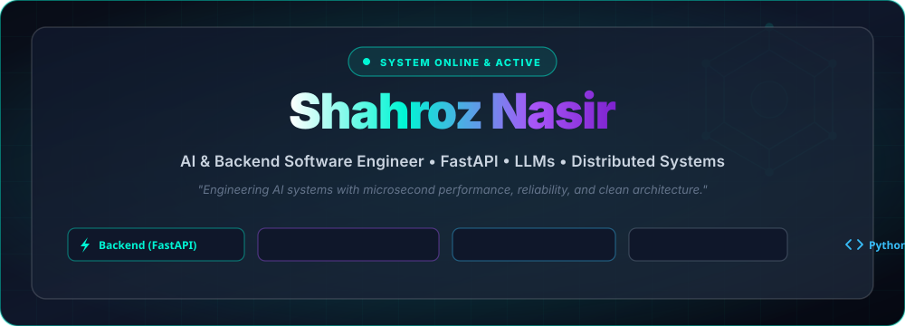

<p align="center">
  
</p>

<p align="center">
  <a href="https://shahroznasir.github.io">
    
  </a>
  <a href="mailto:mdshahroznasir@gmail.com">
    
  </a>
  
  
</p>

<br/>

<p align="center">
  
</p>

<br/>

<!-- INTERACTIVE TERMINAL INTRO -->
<p align="center">
  
</p>

<br/>

<p align="center">
  
</p>

<br/>

## 👨‍💻 Engineering Philosophy & Core Identity

```python
class ShahrozNasir:
    """
    AI & Backend Software Engineer based in Bengaluru, India.
    Specializing in FastAPI, LLM Orchestration, and High-Throughput Async Distributed Systems.
    """
    def __init__(self):
        self.name = "Shahroz Nasir"
        self.handle = "@shahroznasir"
        self.role = "AI & Backend Software Engineer"
        self.location = "Bengaluru, KA, India 🇮🇳"
        self.languages = ["Python", "JavaScript", "TypeScript", "HTML5", "CSS3", "C++"]
        self.core_frameworks = ["FastAPI", "AsyncIO", "Node.js", "Express.js", "REST APIs"]
        self.ai_focus = ["LLM Orchestration", "Agentic Workflows", "Vector Search", "NLP Parsers"]

    def current_mission(self) -> str:
        return "Engineering AI systems with microsecond performance, reliability, and clean architecture."

    def get_contact_info(self) -> dict:
        return {
            "email": "mdshahroznasir@gmail.com",
            "portfolio": "https://shahroznasir.github.io",
            "github": "https://github.com/shahroznasir"
        }

if __name__ == "__main__":
    engineer = ShahrozNasir()
    print(engineer.current_mission())
```

- 🚀 **Asynchronous Architecture**: Specializing in high-concurrency event loops, FastAPI non-blocking web servers, and `httpx` async clients.
- 🧠 **AI & Intelligent Systems**: Building automated LLM parsers, video transcript summarizers, and NLP predictive engines.
- ⚡ **Clean Code & Performance**: Writing modular, strictly typed, high-throughput microservices.

<br/>

<p align="center">
  
</p>

<br/>

## 🏗️ Async System & AI Pipeline Architecture

<p align="center">
  
</p>

<br/>

<p align="center">
  
</p>

<br/>

## 🛠️ Technical Skill Matrix

<div align="center">

### 💻 Core Programming Languages
<p>
  
  
  
  
  
</p>

### ⚡ Frameworks, Microservices & Backend
<p>
  
  
  
  
  
</p>

### 🤖 AI, Machine Learning & NLP
<p>
  
  
  
</p>

### ⚙️ Developer Ecosystem & Infrastructure
<p>
  
  
  
  
</p>

</div>

<br/>

<p align="center">
  
</p>

<br/>

## 🚀 Featured Engineering Projects

<table align="center" width="100%">
  <tr>
    <td width="50%" valign="top">
      <h3 align="center">🤖 adcb-card-ai-platform</h3>
      <p align="center">
        
        
      </p>
      <p>Intelligent AI-driven financial card analytics platform implementing machine learning scoring algorithms in Python.</p>
      <p align="center">
        <a href="https://github.com/shahroznasir/adcb-card-ai-platform"><b>Explore Repository »</b></a>
      </p>
    </td>
    <td width="50%" valign="top">
      <h3 align="center">✈️ TripPlanner</h3>
      <p align="center">
        
        
        
      </p>
      <p>High-concurrency asynchronous travel planning backend service powered by FastAPI and non-blocking HTTP worker threads.</p>
      <p align="center">
        <a href="https://github.com/shahroznasir/TripPlanner"><b>Explore Repository »</b></a>
      </p>
    </td>
  </tr>
  <tr>
    <td width="50%" valign="top">
      <h3 align="center">🎬 youtube-summarizer</h3>
      <p align="center">
        
        
        
      </p>
      <p>Automated pipeline for extracting YouTube video transcripts and generating concise AI summaries instantly.</p>
      <p align="center">
        <a href="https://github.com/shahroznasir/youtube-summarizer"><b>Explore Repository »</b></a>
      </p>
    </td>
    <td width="50%" valign="top">
      <h3 align="center">📄 resume-analyzer</h3>
      <p align="center">
        
        
      </p>
      <p>NLP-powered resume parser extracting candidate skill vectors, experience breakdown, and automated match scoring.</p>
      <p align="center">
        <a href="https://github.com/shahroznasir/resume-analyzer"><b>Explore Repository »</b></a>
      </p>
    </td>
  </tr>
</table>

<br/>

<p align="center">
  
</p>

<br/>

## 🏆 GitHub Achievements & Trophies

<div align="center">
  
</div>

<br/>

<p align="center">
  
</p>

<br/>

## 📊 Live GitHub Analytics Dashboard

<p align="center">
  
  
</p>

<p align="center">
  
</p>

<p align="center">
  
</p>

<br/>

<p align="center">
  
</p>

<br/>

## 🐍 Contribution Grid Snake Animation

<div align="center">
  
</div>

<br/>

<p align="center">
  
</p>

<br/>

## 🤖 Automated CI/CD Workflows

This repository is powered by automated **GitHub Actions**:
- 🐍 **`snake.yml`**: Automatically generates the eating-snake contribution chart every 12 hours.
- 📊 **`metrics.yml`**: Lowighter metrics generation pipeline.
- 🔄 **`update-readme.yml`**: Scheduled daily sync pipeline.

<br/>

<p align="center">
  
</p>

<br/>

## 🌐 Connect & Engage

<div align="center">

<p>
  <a href="mailto:mdshahroznasir@gmail.com">
    
  </a>
  <a href="https://shahroznasir.github.io" target="_blank">
    
  </a>
  <a href="https://github.com/shahroznasir">
    
  </a>
</p>

</div>

<br/>

<!-- ANIMATED FOOTER -->
<p align="center">
  
</p>
